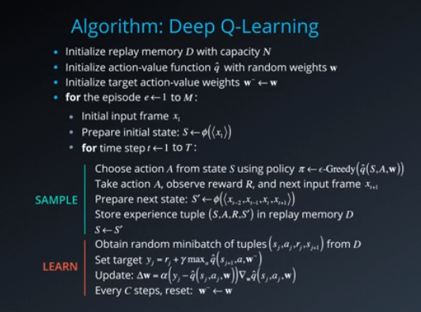
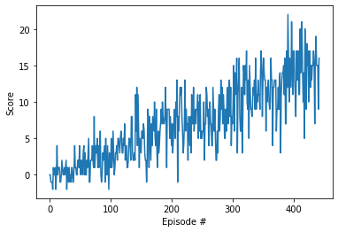

# Project 1 Report

## Learning Algorithm
This project uses the Deep Q-Network (DQN) algorithm to train an agent to move around an environment and pick up bananas. DQN is built off of the idea of Q-Learning algorithms by utilizing neural networks.

The algorithm has two main parts:
- sample the environment and store the experience in the replay memory
- select a random batch of samples from the memory and learn from them

The pseudocode below from Udacity walks through the DQN algorithm.

  

Naive Q-Learning algorithms learn while practicing. However, the algorithm begins to see correlated effects and the outcome may be swayed by this correlation. **Experience Replay** helps break the correlation by storing experiences in the replay buffer. These experiences are later randomly sampled during the learning phase.

The DQN algorithm uses two separate neural networks with identical architectures. The target Q-Network is updated less often than the primary Q-Network.

The hyperparamters were initialized the same as written in the [Udacity DQN Agent](https://github.com/udacity/deep-reinforcement-learning/blob/master/dqn/solution/dqn_agent.py). 

Hyperparameters
- `BUFFER_SIZE = 1e5` is how large the replay buffer should be to store the experience of the agent
- `BATCH_SIZE = 64` is the sampling size for the batches to train on
- `GAMMA = 0.99` is the discount factor
- `TAU = 1e-3` is the soft update of the target parameters
- `LR = 5e-4` is the learning rate
- `UPDATE_EVERY = 4` is how often to update the network
- `eps_start = 1` is the starting epsilon
- `eps_end = 0.01` is the ending epsilon
- `eps_decay = 0.995` is the epsilon decay rate
- `n_episodes = 2000` is the max number of episodes to train on
- `13` is the target mean score to hit to end the training early

## Plot of Rewards
The plot below shows the average score as the DQN agent trained. The algorithm solved the environment in **343** episodes with an average score of **13.01**.

## Ideas for Future Work
- Change the hyperparameters to see how they effect the algorithms ability to learn.
- Write the code using tensorflow.
- Implement the [Rainbow Algorithm](https://arxiv.org/pdf/1710.02298.pdf).
