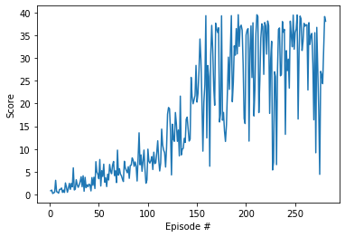

# Project 2 Report

## Learning Algorithm
This project uses the Deep Deterministic Policy Gradient (DDPG) algorithm to train an agent. DDPG utilizes an Actor and Critic network. The critic is used to approximate the maximizer and not as a learned baseline. The actor learns the best action.

The critic evaluates the optimal action-value function using the actor's best believed action.

An **Experience Replay Buffer** is used to store the "memory" of the algorithm. In other words, it's a buffer that keeps the (state, action, reward, next_state) samples. Then when learning, we can randomly sample non-sequential samples from the buffer.

**OU Noise Function** helps the exploration process and allow the agent to explore further out in a single direction.

DDPG uses target networks to copy over the weights from the local network. DDPG uses a **soft-update process** where 0.01% of the weights are copied each time step instead of every x episodes like DQN.

## Neural Network Architecture
The neural network architecture is based off of the architecture provided by the Udacity course. At first there was a problem with training the agent.

* Input layer - The input layer matches the state_size of the environment. This allows the algorithm to tune the neural network based on the input coming in.

* Hidden layers - After discussing the problem with my mentor - I went with 128x128 based on his recommendation.

* Activation - I went with leaky relu to help with the zero-slope parts which seemed to help with training.

* Normalization layers - I added a batch normalization layer to the architecture to help normalize the activation across the batch of samples from the replay buffer.

* Output layer - The output layer size matches the action_size of the enviornment. This allows the neural network to predict the likelihood of choosing each action.

## Plot of Rewards

## Ideas for Future Work

* Get this implementation to work on the 20 agent environment. This would be accomplished by taking the entire array of states instead of just a single state.

* Expand this algorithm to the Crawler environment.

* Try to implement similar algorithms like PPO and A3C and compare performance. A3c would be interesting since it is using an on policy approach.
