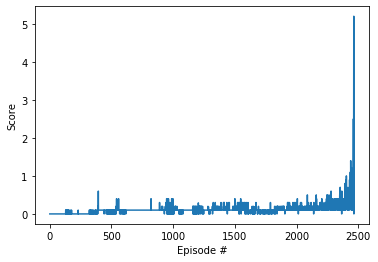

# Project 3 Report

## Learning Algorithm
This project expands the Deep Deterministic Policy Gradient (DDPG) algorithm to train multiple agents (MADDPG).

The *Experience Replay Buffer* can be shared between multiple agents as they share the same actions and states. This fills the buffer faster and gives the neural network more samples to select batches from.

## Neural Network Architecture
The neural network is based off of the architecture provided by the Udacity course and modified based on the second project and for multiple agents.

* Input layer - the input layer matches the state_size of the environment. There are two agents in this environment thus the state_size is the combination of each agent's state.

* Hidden layers - 128x128 hidden layers were chosen since they worked well in the previous assignment

* Activation - Leaky relu

* Normalizaiton - Batch normalization layers were added to normalize the activation.

* Output layer - The output layer matches the action_size for the environment.

## Hyperparameters

* BUFFER_SIZE = int(1e5)  # replay buffer size

* BATCH_SIZE = 128        # minibatch size

* GAMMA = 0.99            # discount factor

* TAU = 1e-3              # for soft update of target parameters

* LR_ACTOR = 1e-4         # learning rate of the actor 

* LR_CRITIC = 1e-3        # learning rate of the critic

## Plot of Rewards

## Ideas for Future Work

concrete future details

* Try implementing this logic on the Soccer environment.

* Explore other algorithms and compare performance. PPO would be interesting as it is used in the DOTA AI.

* Explore the effects of further modifying the neural network hyperparameters (number of layers, activations, normalizations, etc)
